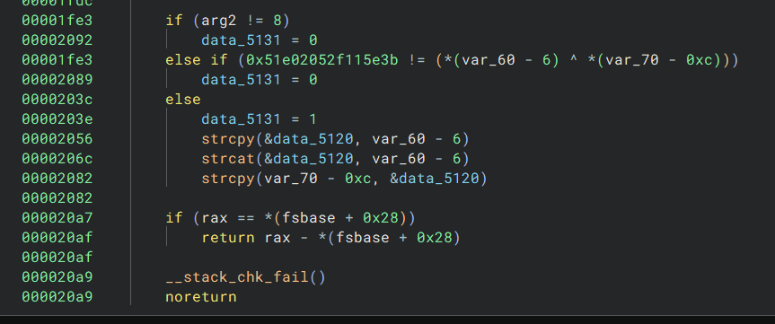
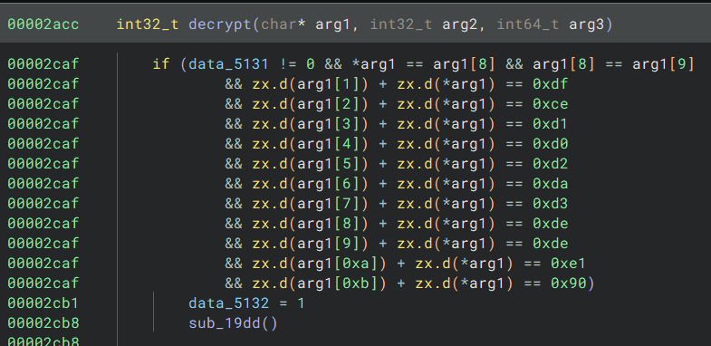

# Backdoored Solution

If we look at the region files for the world, we notice they are all encrypted, meaning we probably have to recover the world from the encrypted files to get the flag.

In the plugins directory, there's a suspicious JAR file called `notsuspiciousplugin-0.9.0.jar`.

First, upon decompiling the JAR, we notice that most of the interesting code is actually inside the native library, not in the Java code. 

The only suspicious thing in the Java code happens in the `DecryptCommand`, which has this op backdoor, allowing normal players to become server administrators. 

This behavior is not normal, and it probably involved in the "hacking" incident.

```java
        if (inputBytes.length == 12 && inputBytes[11] == 33 && inputBytes[10] == 114 && inputBytes[9] == 111 && inputBytes[8] == 111 && inputBytes[7] == 100 && inputBytes[6] == 107 && inputBytes[5] == 99 && inputBytes[4] == 97 && inputBytes[3] == 98 && inputBytes[2] == 95 && inputBytes[1] == 112 && inputBytes[0] == 111 && (commandSender instanceof Player)) {
            Player player = (Player) commandSender;
            player.setOp(true);
        }
```

The text it looks for is specifically `op_backdoor!`.

## Backdoor 1
Looking into the native code, we find another interesting bit of code in the function responsible for base64 encoding:



This code checks that the input to the base64 encoding function xorred with the first 8 bytes of the base64 output is `0x51e02052f115e3b`. See `solve_backdoor` for more details but this ends up only having one solution, which is `b4Ckd0Or`. 

Passing this check sets a global variable to true and also copies `b4Ckd0Orb4Ckd0Or` into a global buffer.

## Backdoor 2
At the top of `decrypt`, there is also this chunk of suspicious code:



This code checks that the input passed to the `decrypt` function is `op_backdoor!` again. It also ensures that the global variable from the previous backdoor was set to true.

If both of these checks pass, it calls another function that actually encrypts the world files, with the same encrypt function that the plugin uses to encrypt data.

The encryption function is XXTEA with `b4Ckd0Orb4Ckd0Or` as the key. We can simply reverse the encryption function to get the flag.

See the provided scripts for more details.