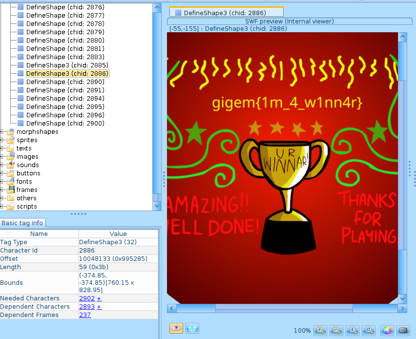

# Impossible

Author: `k.nix`

My friends and I used to play this game all the time as kids! I never managed to win though, can you?

## Dev Notes

Although this challenge runs a website, the only important file is the embedded Flash (SWF) file.

## Solution

This is riff on [The Impossible Quiz](https://impossible-quiz.fandom.com/wiki/The_Impossible_Quiz). Based on the description, I guessed that the author modified the ending screen assets to show the flag instead of the original victory screen. However, actually playing the game takes forever, so I looked for ways to examine the contents of `impossible_ctf.swf`. After googling "flash decompiler", I found https://github.com/jindrapetrik/jpexs-decompiler. After scrolling through the tabs, I found the flag scene as one of the last few assets under "shapes".

flag:
`gigem{1m_4_w1nn4r}`
